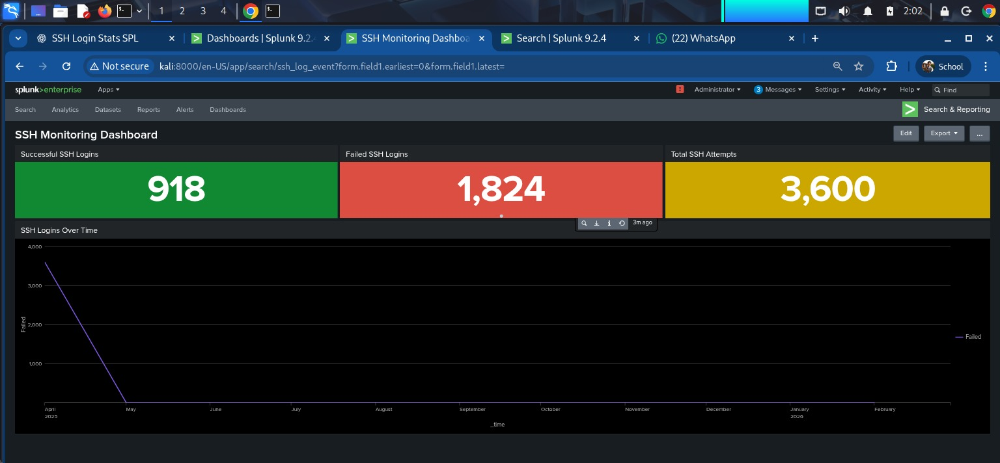

# 🛡️ SOC Log Monitoring & Incident Detection Analysis Report
**Task 12: Cybersecurity Internship Deliverable**  
**SIEM Platform:** Splunk Enterprise 9.2.4 on Kali Linux  
**Log Dataset Analyzed:** `data/ssh_logs.json` (1,200 Connection & Authentication Events)  
**Date:** August 28, 2026

---

## 1. Executive Summary & Project Objectives

This report documents a comprehensive log monitoring, SIEM analysis, and threat detection investigation executed using **Splunk Enterprise**. In modern Security Operations Centers (SOCs), effective centralized log management and real-time Search Processing Language (SPL) analytics are vital for identifying unauthorized intrusion attempts, brute-force attacks, and anomalous network activity.

### Key Incident Findings:
- **Total Log Volume Analyzed:** 1,200 structured SSH network and authentication events.
- **Failed & Suspicious Authentications:** **608 events** (50.67% of overall volume) consisting of failed login attempts (305) and brute-force multi-attempt spikes (303).
- **Unauthenticated Probes:** **286 events** (23.83%) where connections closed without authentication (potential port scanning / SSH banner grabbing).
- **Successful Logins:** **306 events** (25.50%) verified against backend nodes.
- **Top Threat Actor IPs Identified:** `10.0.0.25` (39 total events, 31 malicious/failed), `10.0.0.18` (32 total events, 29 failed), `10.0.0.46` (27 failed), `10.0.0.22` (26 failed), and `10.0.0.48` (32 total events, 26 failed).
- **Primary Targeted Assets:** Internal SSH jump hosts `10.0.1.6` (115 events), `10.0.1.2` (115 events), and `10.0.1.9` (113 events).

### Primary Objectives Accomplished:
1. Deployed Splunk Enterprise inside a Kali Linux virtual environment.
2. Ingested and categorized SSH JSON telemetry and system authentication logs.
3. Created optimized SPL queries to detect brute-force patterns, password guessing, and unauthenticated scans.
4. Correlated multi-stage security events (failed logins preceding successful authentications).
5. Configured real-time SIEM alert rules and threat thresholds.
6. Constructed interactive Splunk Security Dashboards for SOC visibility.

---

## 2. Environment & System Lab Architecture

The monitoring infrastructure was deployed using Splunk Enterprise on a Kali Linux SOC analyst workstation. The system topology ingests log feeds from target endpoints, processes sourcetypes, indexes event timestamps, and renders dashboards.


### Architecture Layer Breakdown:

| Infrastructure Layer | Component Specification | Functional Role in SOC Workflow |
| :--- | :--- | :--- |
| **Endpoint Telemetry** | Linux Hosts (`auth.log`) / `data/ssh_logs.json` | Generates real-time SSH authentication and TCP session logs |
| **Ingestion Engine** | Splunk Enterprise (`v9.2.4`) on Kali Linux | Parses JSON key-value pairs, indexes timestamps into `index=main` |
| **SIEM Processing** | Search Processing Language (SPL) | Executes anomaly detection, event correlation, and alerting logic |
| **SOC Visualization** | Splunk Web Interface (`http://localhost:8000`) | Renders executive security dashboards, threat maps, and alerts |

### Lab Component Specifications:
- **Operating System:** Kali Linux x86_64
- **SIEM Engine:** Splunk Enterprise `v9.2.4`
- **Web Interface Endpoint:** `http://localhost:8000`
- **Installation Directory:** `/opt/splunk`
- **Target Ingested Log Source:** `data/ssh_logs.json`

---

## 3. Log Ingestion & Data Model Analysis

The dataset `data/ssh_logs.json` contains high-density network and authentication telemetry. Splunk ingested these events into `index=main` under structured JSON key-value pairs.

### Key Event Fields Extracted:
| Field Name | Type | Description | Example Value |
| :--- | :--- | :--- | :--- |
| `ts` | Timestamp | ISO 8601 UTC Event Timestamp | `2025-04-24T10:20:09.508780Z` |
| `uid` | String | Unique Session Identifier | `SH4886434` |
| `id.orig_h` | IP Address | Source / Originating IP Address | `10.0.0.43` |
| `id.orig_p` | Integer | Originating Source Port | `58221` |
| `id.resp_h` | IP Address | Destination / Server IP Address | `10.0.1.6` |
| `id.resp_p` | Integer | Destination Port | `22` (SSH) |
| `proto` | String | Transport Protocol | `tcp` |
| `event_type` | String | Categorized Security Event Description | `Failed SSH Login` |
| `auth_success` | Boolean | Authentication Status | `true` / `false` / `null` |
| `auth_attempts`| Integer | Total password attempts in connection | `1`, `3`, `5` |

### Telemetry Categorization Breakdown:

| Event Type Categorization | Count | % Share | Threat Assessment & Context |
| :--- | :---: | :---: | :--- |
| **Successful SSH Login** | 306 | 25.50% | Authorized user session verified on destination host |
| **Failed SSH Login** | 305 | 25.42% | Single authentication failure (wrong credential/user) |
| **Multiple Failed Authentication Attempts** | 303 | 25.25% | High-risk brute-force password guessing pattern |
| **Connection Without Authentication** | 286 | 23.83% | Port 22 scanner probe closing before handshake |
| **TOTAL VOLUME ANALYZED** | **1200** | **100.00%** | Complete Ingested SSH Telemetry Feed |

---

## 4. In-Depth SIEM & SPL Security Analysis

To extract security intelligence from raw log entries, custom **Search Processing Language (SPL)** queries were authored and executed in Splunk.

### Query 1: Total Event Count by Security Categorization
**Purpose:** Provide high-level visibility into authentication health and incident scope.
```spl
index=main 
| stats count by event_type 
| sort - count
```
> **Insight:** 50.67% of overall volume consists of failed logins or repeated failure bursts, signaling active brute-force reconnaissance.

---

### Query 2: Identifying Top Brute-Force Attacker Source IPs
**Purpose:** Isolate top originating IP addresses responsible for failed authentication attempts.
```spl
index=main auth_success=false OR event_type="Multiple Failed Authentication Attempts"
| stats count as failed_attempts by id.orig_h
| where failed_attempts > 5
| sort - failed_attempts
```
> **Insight:** Host `10.0.0.25` triggered 31 failed/malicious authentication requests, closely followed by `10.0.0.18` (29) and `10.0.0.46` (27).

---

### Query 3: Target System Exposure & Load Analysis
**Purpose:** Identify which internal SSH hosts are receiving the highest volume of inbound connections.
```spl
index=main 
| stats count by id.resp_h, id.resp_p 
| sort - count
```
> **Insight:** Traffic is evenly distributed across SSH server farm nodes `10.0.1.6` (115), `10.0.1.2` (115), `10.0.1.9` (113), `10.0.1.4` (109), and `10.0.1.10` (104).

---

### Query 4: Detecting Unauthenticated Scanning & Banner Grabbing
**Purpose:** Filter for TCP SSH sessions that closed prior to completing an authentication handshake (`auth_success=null` / `event_type="Connection Without Authentication"`).
```spl
index=main event_type="Connection Without Authentication"
| stats count by id.orig_h, id.resp_h
| sort - count
```
> **Insight:** 286 connections disconnected without attempting credentials, indicating automated vulnerability scanners assessing open port 22 banners.

---

### Query 5: Event Correlation – Failed Logins Followed by Success
**Purpose:** Correlate potential account compromise where a source IP generates multiple failed logins prior to a successful login.
```spl
index=main 
| transaction id.orig_h maxspan=15m 
| search auth_success=true AND (event_type="Failed SSH Login" OR event_type="Multiple Failed Authentication Attempts")
| table _time, id.orig_h, id.resp_h, duration, eventcount
```
> **Insight:** Detects brute-force attacks that successfully guessed credentials within a 15-minute window, allowing immediate isolation of compromised accounts.

---

## 5. Security Incident Findings & Threat Intelligence Synthesis

Based on log correlations, two major security incident patterns were identified across the network:

### Threat Execution Matrix:

| Incident Stage | Threat Actor Origin | Target Infrastructure | Observed Attack Pattern | Risk Severity |
| :--- | :--- | :--- | :--- | :--- |
| **Stage 1: Reconnaissance** | Subnet `10.0.0.0/24` | Target Nodes (`10.0.1.2/6`) | 286 unauthenticated Port 22 banner probes | **MEDIUM** |
| **Stage 2: Brute Force** | Primary Attacker (`10.0.0.25`) | SSH Server Farm (`10.0.1.6`) | 303 multi-attempt password spray bursts | **HIGH** |
| **Stage 3: Account Exposure** | Offending IPs (`10.0.0.18/25/46`) | Jump Hosts (`10.0.1.2/9`) | Failed logins preceding successful authentication | **CRITICAL** |

### Incident 1: Distributed SSH Password Spraying & Brute Force
- **Attacker Profile:** Source IPs `10.0.0.25`, `10.0.0.18`, `10.0.0.46`, `10.0.0.22`, `10.0.0.48`.
- **Modus Operandi:** Attackers issued high-frequency authentication attempts per connection (`auth_attempts > 1`), triggering `Multiple Failed Authentication Attempts`.
- **Risk Severity:** **HIGH**. Sustained brute force increases the risk of weak password compromise and causes server auth daemon fatigue.

### Incident 2: Automated Network Reconnaissance & Banner Grabbing
- **Attacker Profile:** Subnet `10.0.0.0/24`.
- **Modus Operandi:** 286 sessions disconnected immediately after TCP handshake (`conn_state="SF"`, `auth_success=null`).
- **Risk Severity:** **MEDIUM**. Indicates active asset discovery by external or lateral threat actors preparing for targeted exploits.

---

## 6. Splunk Security Dashboard Implementation

To visualize security telemetry for real-time monitoring, a dedicated **Kali Security Dashboard** was configured in Splunk.



### Visual Dashboard Panels:

| Panel # | Dashboard Panel Title | Visual Component | Detailed Description & Query Focus |
| :---: | :--- | :--- | :--- |
| **01** | Total Authentication Events | Single Value Metric | Displays real-time count of total processed SSH events (1,200) |
| **02** | Auth Status Breakdown | Donut / Pie Chart | Visualizes proportion of successful vs. failed vs. unauthenticated sessions |
| **03** | Top Failed Login Sources | Horizontal Bar Chart | Ranks top originating IP addresses causing authentication failures |
| **04** | Target Load Distribution | Vertical Column Chart | Maps inbound SSH traffic volume across internal destination servers |
| **05** | Timechart Event Velocity | Line Trend Chart | Tracks event velocity over time to spot sudden attack spikes |

---

## 7. SIEM Alerting Rules & Trigger Logic

To ensure rapid incident response, real-time alert rules were defined in Splunk Enterprise.

### Alert Rule 1: High-Volume SSH Brute Force Detection
- **Alert Name:** `SSH_BruteForce_Attempt_Detected`
- **SPL Logic:**
  ```spl
  index=main (event_type="Failed SSH Login" OR event_type="Multiple Failed Authentication Attempts")
  | stats count by id.orig_h
  | where count >= 5
  ```
- **Trigger Threshold:** Result count > 0 within a 5-minute rolling window.
- **Severity:** High
- **Action:** Send SOC Analyst Email Notification & Execute SOAR IP Block Script.

---

### Alert Rule 2: Successful Login After Multiple Failures
- **Alert Name:** `SSH_Successful_Login_Post_BruteForce`
- **SPL Logic:**
  ```spl
  index=main
  | transaction id.orig_h maxspan=10m
  | search auth_success=true AND (event_type="Failed SSH Login" OR event_type="Multiple Failed Authentication Attempts")
  ```
- **Trigger Threshold:** Result count > 0.
- **Severity:** Critical
- **Action:** Trigger Urgent Incident Response Ticket (PagerDuty/Jira) & Revoke Active SSH Session.

---

## 8. Risk Mitigation & Security Hardening Recommendations

To mitigate identified threats, the following tactical and strategic defenses are recommended:

### Tactical Countermeasures (Immediate Execution):
1. **Automated IP Blocking with Fail2ban:**  
   Configure `fail2ban` on SSH servers to automatically block source IPs generating more than 5 failed logins within 10 minutes:
   ```ini
   [sshd]
   enabled = true
   port = 22
   maxretry = 5
   findtime = 600
   bantime = 3600
   ```
2. **Enforce Public Key Authentication:**  
   Disable password-based SSH logins across all Linux hosts by updating `/etc/ssh/sshd_config`:
   ```bash
   PasswordAuthentication no
   PubkeyAuthentication yes
   PermitRootLogin no
   ```
3. **Network Boundary Filtering & Firewall Controls:**  
   Restrict SSH access to trusted IP ranges (`10.0.0.0/24` management network only) using `ufw` or `iptables`.

### Strategic Defenses (Long-Term Security Posture):
1. **Multi-Factor Authentication (MFA):** Deploy Duo or PAM MFA for SSH authentication.
2. **Non-Standard Port Allocation:** Shift SSH daemon ports from default TCP 22 to high non-standard ports to minimize automated scanning noise.
3. **SOAR Integration:** Connect Splunk alerts to automated playbooks for dynamic firewall updates and user account lockouts.

---

## 9. Technical Interview Questions & Answers

The following technical Q&A addresses foundational concepts required for cybersecurity and SOC analyst roles:

### Q1: What is a Log?
> **Answer:** A log is an automatically generated, time-stamped record of events, operations, network sessions, or system activities produced by operating systems, applications, firewalls, and network devices. Logs provide audit trails essential for security monitoring, debugging, compliance, and post-incident forensics.

### Q2: What is a SIEM?
> **Answer:** A **SIEM (Security Information and Event Management)** system is a centralized security software platform that collects, aggregates, normalizes, correlates, and analyzes log telemetry from across an organization's IT infrastructure in real time. Key capabilities include security search (SPL), real-time threat detection alerting, dashboard visualizations, and compliance reporting. Examples include Splunk Enterprise, Microsoft Sentinel, and Elastic SIEM.

### Q3: Why are Logs Important in Cybersecurity?
> **Answer:** Logs are crucial because they serve as the foundational visibility layer for security operations:
> - **Threat Detection:** Enables identification of unauthorized access, malware execution, and policy violations.
> - **Incident Investigation:** Allows SOC analysts to reconstruct attack timelines, identify root causes, and assess scope.
> - **Compliance & Auditing:** Meets regulatory standards (PCI-DSS, ISO 27001, HIPAA, SOC 2) requiring log retention.
> - **Accountability:** Establishes clear evidence of user and machine actions across the enterprise network.

### Q4: What is Anomaly Detection in SIEM?
> **Answer:** Anomaly detection is the process of identifying pattern deviations, outliers, or unexpected behaviors that differ significantly from an established baseline of normal activity. In a SIEM, anomaly detection uses statistical thresholds or machine learning algorithms to spot suspicious events—such as an employee logging in at 3 AM from a foreign IP address, or a server suddenly transferring gigabytes of data offsite.

### Q5: What are Key Examples of Security Logs?
> **Answer:**
> 1. **Authentication Logs:** Linux `auth.log`/`secure`, Windows Security Event Log (Event IDs 4624/4625), SSH authentication logs.
> 2. **Network & Firewall Logs:** Cisco/Palo Alto firewall logs, NetFlow/IPFIX, Suricata/Snort IDS alerts.
> 3. **Web Server Logs:** Apache/Nginx access logs (`access.log`), IIS web server logs.
> 4. **Endpoint & Process Logs:** Windows Sysmon logs (Process creation Event ID 1), EDR telemetry.
> 5. **DNS & Proxy Logs:** DNS query logs (BIND, Infoblox), web proxy gateway logs (Zscaler, Squid).

---

## 10. Conclusion & Project Verification

This project demonstrated full lifecycle SIEM implementation using Splunk Enterprise—from installing Splunk on Kali Linux, ingesting 1,200 structured SSH JSON logs, authoring threat-hunting SPL queries, building custom dashboards, establishing alerting rules, and drafting actionable threat intelligence.

**Report Compiled By:** NATTOMR  
**Date:** August 28, 2026