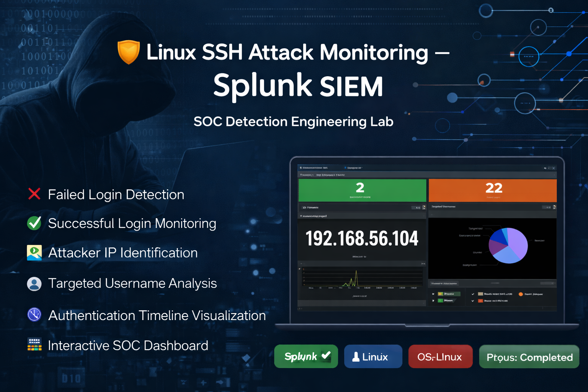
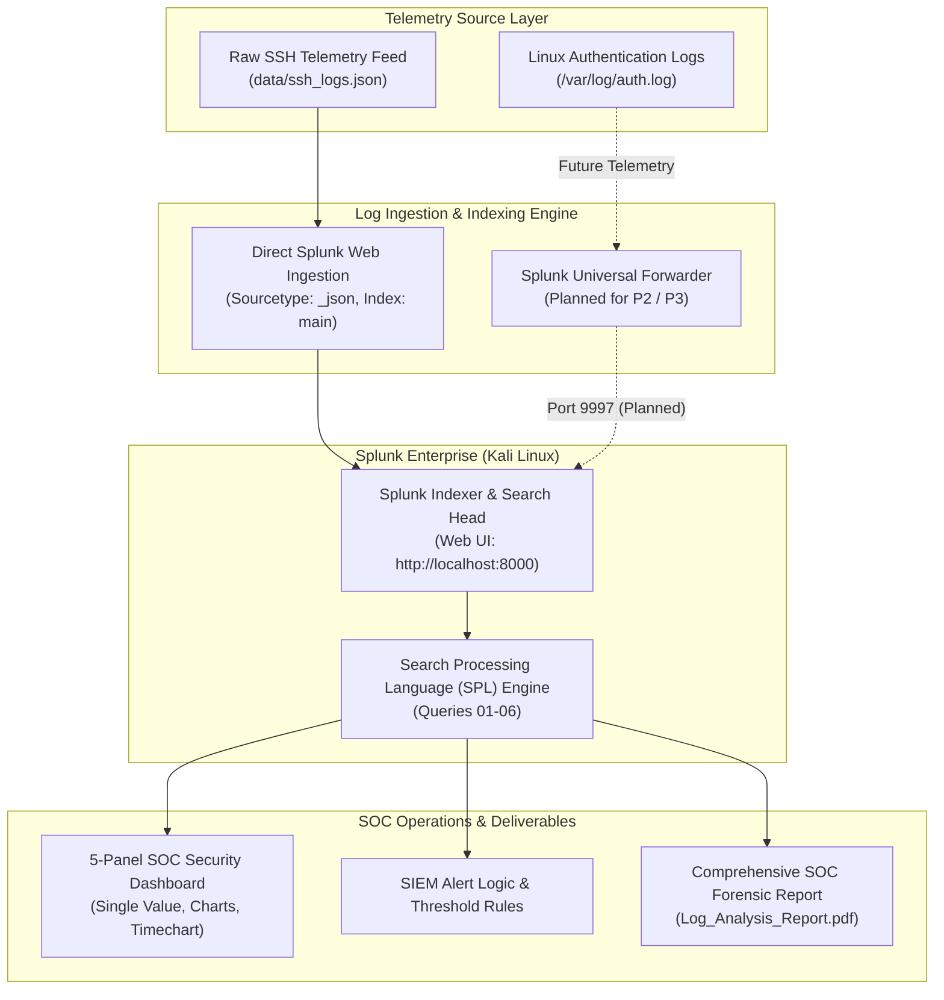
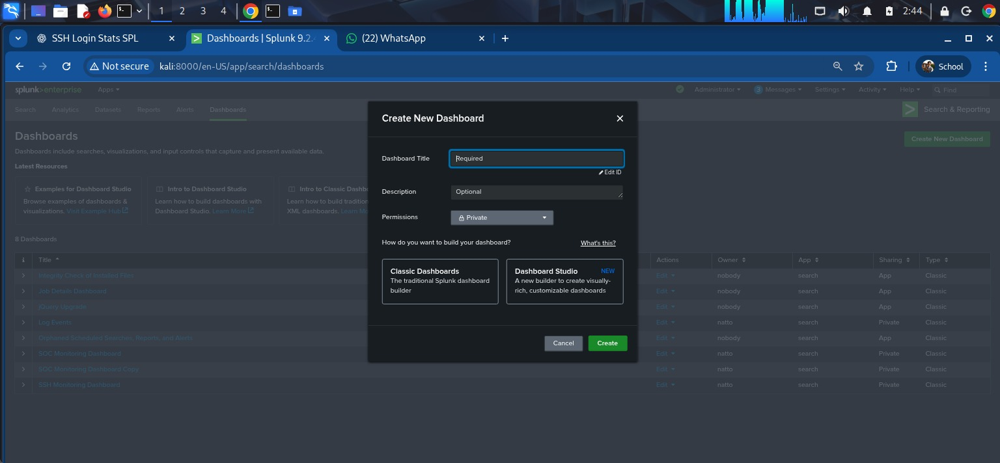
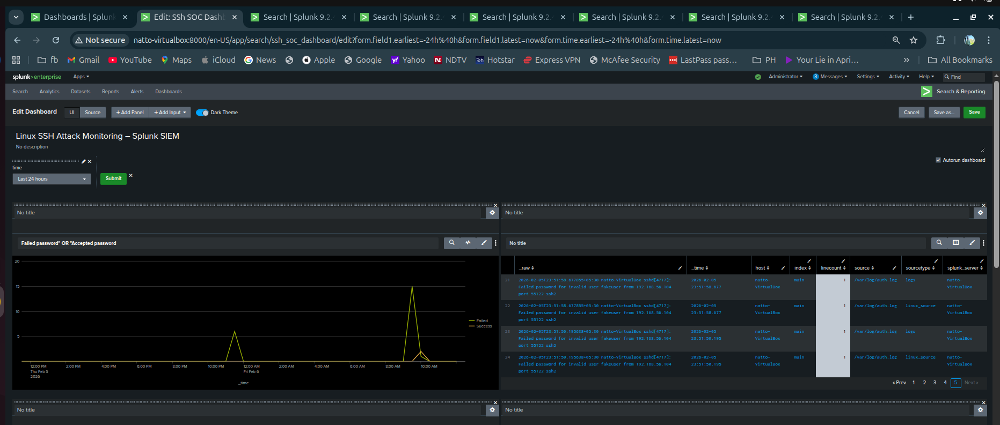

# 🛡️ P1 — Splunk SOC Home Lab & Log Analysis

[](https://github.com/NATTOMR/splunk-soc-threat-hunting-lab)
[](https://www.splunk.com/)
[](https://www.kali.org/)
[](data/ssh_logs.json)
[-red.svg)](Log_Analysis_Report.pdf)
[](https://opensource.org/licenses/MIT)

> **Master Portfolio Component:** This project represents **Project P1** in the [Splunk SOC & Threat Hunting Lab](https://github.com/NATTOMR/splunk-soc-threat-hunting-lab) portfolio. While originally originating from an intensive cybersecurity internship log monitoring exercise (Task 12), the project has been formalized as the foundational P1 lab demonstrating standalone Splunk Enterprise deployment, structured JSON telemetry ingestion, custom SPL analytics, multi-panel SOC dashboarding, and incident triage.



---

## 1. Project Overview

Project P1 establishes the foundational Security Operations Center (SOC) monitoring and analysis environment using **Splunk Enterprise**. The primary objective of this project is to simulate real-world Tier 1/Tier 2 SOC workflows by ingesting authentication and network telemetry, detecting unauthorized access attempts, analyzing brute-force password spraying campaigns, and synthesizing findings into executive and analyst-ready deliverables.

### Operational Context
- **Lab Type:** Standalone SOC Home Lab / Educational Security Monitoring Environment
- **Core Focus:** Centralized Log Ingestion, SPL Development, SSH Authentication Forensics, and Visual Dashboard Engineering
- **Target Data Feed:** 1,200 structured SSH connection and authentication records (`data/ssh_logs.json`)
- **Master Portfolio Link:** [NATTOMR/splunk-soc-threat-hunting-lab](https://github.com/NATTOMR/splunk-soc-threat-hunting-lab)

---

## 2. Objectives

- **SIEM Installation & Management:** Deploy, configure, and maintain Splunk Enterprise `v9.2.4` on a Linux virtualization host.
- **Data Ingestion & Field Extraction:** Ingest high-density JSON security logs, validate automatic key-value field extraction, and verify index partitioning (`index=main`).
- **SPL Threat Hunting:** Formulate custom Search Processing Language (SPL) queries to isolate authentication anomalies, calculate failure ratios, and evaluate host exposure.
- **Incident Investigation:** Triage brute-force attempts, detect port 22 reconnaissance probes, and correlate multi-stage authentication behaviors across sliding time windows.
- **SOC Dashboard Engineering:** Design and build an operational 5-panel SOC Security Dashboard providing single-pane-of-glass visibility.
- **Alert Logic Formulation:** Define SIEM alert triggers and threshold criteria for high-volume brute-force attacks.
- **Professional Reporting:** Document findings, attacker profiles, and defensive hardening measures in a publication-grade SOC report.

---

## 3. SOC Architecture

The laboratory models a centralized SIEM telemetry pipeline:




*(For in-depth architectural notes, see [docs/architecture.md](docs/architecture.md))*

---

## 4. Environment

- **Virtualization Hypervisor:** VirtualBox (Isolated Host-Only & NAT network segments)
- **Host Workstation:** Kali Linux x86_64
- **Splunk Enterprise Directory:** `/opt/splunk`
- **Splunk Web Interface:** `http://localhost:8000`
- **Splunk Management Port:** `8089/tcp`
- **Primary Data Store:** `index=main`

---

## 5. Technology Stack

| Technology / Component | Version / Role | Lab Implementation Status |
|---|---|:---:|
| **Splunk Enterprise** | `v9.2.4` — Central SIEM platform, search head, and indexer | ✅ **IMPLEMENTED** |
| **Search Processing Language (SPL)** | Syntax for statistical aggregation, correlation, and alerts | ✅ **IMPLEMENTED** |
| **Linux Host** | Kali Linux — SIEM host environment | ✅ **IMPLEMENTED** |
| **JSON Data Parser** | Splunk `_json` sourcetype parser and field extractor | ✅ **IMPLEMENTED** |
| **Splunk Universal Forwarder** | Endpoint agent shipping logs over port 9997 | ⚪ **PLANNED (P2/P3)** |
| **MITRE ATT&CK Mapping** | Framework mapping for brute-force and reconnaissance tactics | 🟡 **PARTIALLY IMPLEMENTED** |
| **Automated SOAR Action** | Dynamic firewall blocking / account lockout scripts | ⚪ **PLANNED** |

---

## 6. Splunk Installation & Service Health

Splunk Enterprise was installed on the Kali Linux host using the official Debian package:

```bash
# 1. Download official Debian package
wget -O splunk-9.2.4-c103a21bb11d-linux-2.6-amd64.deb "https://download.splunk.com/products/splunk/releases/9.2.4/linux/splunk-9.2.4-c103a21bb11d-linux-2.6-amd64.deb"

# 2. Install package via dpkg
sudo dpkg -i splunk-9.2.4-c103a21bb11d-linux-2.6-amd64.deb

# 3. Start service and configure administrator credentials
sudo /opt/splunk/bin/splunk start --accept-license

# 4. Enable boot-start and check status
sudo /opt/splunk/bin/splunk enable boot-start
sudo /opt/splunk/bin/splunk status
```

| Startup Verification | Service Status Confirmation |
|---|---|
|  |  |

*(Detailed deployment steps documented in [docs/installation.md](docs/installation.md))*

---

## 7. Log Ingestion & Data Management

In this lab, log telemetry is loaded into Splunk via direct structured file ingestion:

1. In Splunk Web, open **Settings** → **Add Data** → **Upload**.
2. Upload [`data/ssh_logs.json`](data/ssh_logs.json).
3. Set Source Type to `_json`. Splunk automatically parses the nested JSON key-value schema.
4. Set Target Index to `main`.

| Splunk Web Console |
|---|
|  |

*(See [docs/log-ingestion.md](docs/log-ingestion.md) for full ingestion and schema documentation)*

---

## 8. Dataset Profile

The dataset [`data/ssh_logs.json`](data/ssh_logs.json) comprises **1,200 structured SSH connection events**:

| Event Type | Count | % Share | Threat Assessment |
|---|:---:|:---:|---|
| **Successful SSH Login** | 306 | 25.50% | Verified legitimate authentication session |
| **Failed SSH Login** | 305 | 25.42% | Single failed attempt (credential error / bad password) |
| **Multiple Failed Authentication Attempts** | 303 | 25.25% | High-frequency brute-force password guessing burst |
| **Connection Without Authentication** | 286 | 23.83% | Port 22 reconnaissance probe / SSH banner grab |
| **Total Ingested Volume** | **1,200** | **100.0%** | **50.67% total malicious / anomalous traffic** |

---

## 9. SPL Query Library

The project includes modular, reusable SPL scripts located under [`queries/`](queries/):

| Query File | Purpose | Security Use Case |
|---|---|---|
| [`01_event_type_distribution.spl`](queries/01_event_type_distribution.spl) | Aggregate events by categorization | Baseline authentication health check |
| [`02_bruteforce_attacker_ips.spl`](queries/02_bruteforce_attacker_ips.spl) | Rank top offending source IPs | Attacker triage & firewall containment |
| [`03_target_server_exposure.spl`](queries/03_target_server_exposure.spl) | Map inbound traffic per target server | Asset exposure & risk assessment |
| [`04_unauthenticated_ssh_probes.spl`](queries/04_unauthenticated_ssh_probes.spl) | Detect port 22 connections with no auth | Reconnaissance / banner grabbing detection |
| [`05_failed_login_to_success_correlation.spl`](queries/05_failed_login_to_success_correlation.spl) | Correlate failure bursts leading to success | Critical detection: Compromised accounts |
| [`06_high_volume_bruteforce_detection.spl`](queries/06_high_volume_bruteforce_detection.spl) | Threshold-based alert trigger logic | Operational SIEM alert rule (>5 failures) |

---

## 10. Threat Detection & Investigation Findings

Detailed analysis of the 1,200 events revealed active adversary reconnaissance and coordinated password guessing:

### Top Threat Actor IPs
Statistical analysis isolated the primary sources responsible for the brute-force activity:
1. **`10.0.0.25`**: 39 total connections — **31 failed/brute-force attempts** (Primary Threat Actor).
2. **`10.0.0.18`**: 32 total connections — **29 failed attempts**.
3. **`10.0.0.46`**: 27 failed attempts.
4. **`10.0.0.22`**: 26 failed attempts.
5. **`10.0.0.48`**: 32 total connections — **26 failed attempts**.

### Primary Target Assets
Adversary traffic heavily targeted three internal SSH jump hosts:
- **`10.0.1.6`** (115 total connections)
- **`10.0.1.2`** (115 total connections)
- **`10.0.1.9`** (113 total connections)

### Event Correlation (Compromise Indicator)
Using transaction grouping across a 15-minute sliding window:
```spl
index=main 
| transaction id.orig_h maxspan=15m 
| search auth_success=true AND (event_type="Failed SSH Login" OR event_type="Multiple Failed Authentication Attempts")
| table _time, id.orig_h, id.resp_h, duration, eventcount
```
The query identified sessions where repetitive authentication failures culminated in a successful login from the same origin IP. In a SOC environment, this constitutes a **Critical Tier 1 Incident** indicating a breached credential.

*(Read the complete investigation findings in [docs/investigation.md](docs/investigation.md))*

---

## 11. SOC Security Dashboard

An operational 5-panel dashboard was constructed in Splunk Web to provide consolidated visibility:


### Dashboard Panels

| Panel | Name | Visualization | Visual Exhibit | Metric / Security Purpose |
|:---:|---|---|:---:|---|
| **01** | Total Ingested Events | Single Value |  | Ingested scope tracking (`1,200` events) |
| **02** | Auth Status Breakdown | Pie Chart |  | Proportional distribution of auth outcomes |
| **03** | Attacker IP Ranking | Bar Chart |  | Top offending sources (`10.0.0.25`, `10.0.0.18`) |
| **04** | Target Server Load | Column Chart |  | Connection volume per internal server |
| **05** | Attack Velocity | Timechart |  | Trend analysis of event categories over time |

### Additional Dashboard Perspectives
| Overview Perspective | Detailed Events View |
|---|---|
|  |  |

*(See [dashboards/README.md](dashboards/README.md) for panel-by-panel reconstruction instructions)*

---

## 12. Alerting Logic

An alert rule was formulated to detect brute-force surges:

```spl
index=main (event_type="Failed SSH Login" OR event_type="Multiple Failed Authentication Attempts")
| stats count by id.orig_h
| where count >= 5
```

- **Execution Frequency:** Scheduled every 5 minutes (or real-time stream).
- **Trigger Threshold:** When `count >= 5` failed attempts within 5 minutes.
- **Action Plan:**
  1. Generate a high-priority SIEM alert in the SOC analyst queue.
  2. Dispatch notification email with source IP and target host details.
  3. (Planned Automation) Trigger firewall drop rule or fail2ban jail for the offending IP.

---

## 13. Security Hardening Recommendations

Based on the forensic analysis, the following host and network defenses are recommended:

1. **Disable Password-Based Authentication:** Enforce SSH Public Key Authentication (`ed25519`) and set `PasswordAuthentication no` in `/etc/ssh/sshd_config`.
2. **Implement Rate Limiting & Fail2Ban:** Enforce automated ban rules after 3 consecutive authentication failures.
3. **Change Default SSH Listening Port:** Move SSH from port 22 to a non-standard port to reduce automated background scanning noise.
4. **Deploy Bastion / Jump Host Controls:** Restrict SSH exposure using network firewall ACLs and require VPN access with Multi-Factor Authentication (MFA).

---

## 14. Project Structure

```text
splunk-p1-soc-home-lab/
├── configs/                             # Configuration templates
│   ├── inputs.conf.example              # Sample Universal Forwarder input stanzas
│   └── props.conf.example               # Sample JSON and Linux log parsing rules
├── dashboards/                          # Dashboard documentation
│   └── README.md                        # Step-by-step dashboard reconstruction guide
├── data/                                # Primary telemetry data
│   └── ssh_logs.json                    # 1,200-event structured SSH log dataset
├── docs/                                # Detailed technical documentation
│   ├── architecture.md                  # Lab topology and telemetry pipeline details
│   ├── installation.md                  # Splunk Enterprise deployment walkthrough
│   ├── investigation.md                 # Threat actor profiling and incident forensics
│   ├── log-ingestion.md                 # Ingestion workflow and data dictionary
│   └── original-internship-task.pdf     # Reference document from initial project origin
├── queries/                             # Modular SPL search library
│   ├── 01_event_type_distribution.spl
│   ├── 02_bruteforce_attacker_ips.spl
│   ├── 03_target_server_exposure.spl
│   ├── 04_unauthenticated_ssh_probes.spl
│   ├── 05_failed_login_to_success_correlation.spl
│   └── 06_high_volume_bruteforce_detection.spl
├── screenshots/                         # Verifiable visual evidence assets
│   ├── banner.png
│   ├── dashboard-overview-1.png
│   ├── dashboard-overview-2.png
│   ├── dashboard-panel-01.jpeg through 05.jpeg
│   ├── lab-architecture.jpg
│   ├── soc-dashboard.jpeg
│   ├── splunk-home.png
│   ├── splunk-startup.png
│   └── splunk-status.png
├── build_pdf.py                         # Python script for compiling PDF reports
├── Log_Analysis_Report.md               # 10-section comprehensive SOC analysis report
├── Log_Analysis_Report.pdf              # Compiled executive-ready PDF deliverable
└── README.md                            # Main project documentation
```

---

## 15. Implementation Status Breakdown

| Capability / Milestone | Status | Notes |
|---|:---:|---|
| **Splunk Enterprise Deployment** | ✅ **IMPLEMENTED** | Verified running on Kali Linux (`http://localhost:8000`). |
| **SSH Log Dataset Ingestion** | ✅ **IMPLEMENTED** | 1,200 structured events ingested into `index=main`. |
| **SPL Threat Hunting Library** | ✅ **IMPLEMENTED** | 6 documented, modular `.spl` queries under `queries/`. |
| **Brute-Force & Probe Analysis** | ✅ **IMPLEMENTED** | Isolated top threat actor IPs and target servers. |
| **Multi-Stage Event Correlation** | ✅ **IMPLEMENTED** | Identified failed-to-success session progression. |
| **5-Panel SOC Dashboard** | ✅ **IMPLEMENTED** | Built, validated, and visually documented. |
| **Comprehensive SOC Report** | ✅ **IMPLEMENTED** | Available in both Markdown and compiled PDF. |
| **SIEM Alert Logic** | 🟡 **PARTIALLY IMPLEMENTED** | Defined in SPL; automated email/script actions planned. |
| **Splunk Universal Forwarder** | ⚪ **NOT YET IMPLEMENTED** | Documented in `configs/`; planned for P2/P3. |
| **Live Windows / Linux Endpoints** | ⚪ **NOT YET IMPLEMENTED** | Planned for dedicated project milestones (P2 & P3). |

---

## 16. Future Enhancements

- **Universal Forwarder Deployment:** Transition from batch JSON upload to real-time endpoint streaming over encrypted port 9997 (Project P2 & P3).
- **Windows Security Telemetry:** Ingest Sysmon and Windows Security Event Logs (Event IDs 4624, 4625) for credential attack analysis (Project P2).
- **Automated SOAR Integration:** Connect alert outputs to automated mitigation scripts (e.g., dynamic IP blocking via iptables / firewall APIs).
- **Threat Intelligence Enrichment:** Automate IP reputation lookups using AbuseIPDB and VirusTotal via Splunk lookup tables.

---

## 17. Lessons Learned

- **Value of Structured Logging:** JSON-formatted network telemetry dramatically simplifies field extraction compared to unformatted syslog, eliminating brittle regex operations.
- **Statistical Filtering is Essential:** Raw event volume can overwhelm analysts; applying statistical thresholds (`where failed_attempts > 5`) is critical to isolate deliberate adversary attacks from ordinary user typos.
- **Transaction Correlation Unveils Intent:** Isolated failed logins only show attempts; correlating failures leading to successful logins reveals potential account compromise.

---

## 18. Master Portfolio Navigation

This project is part of a complete 10-part SOC & Threat Hunting Portfolio:

| Milestone | Project Title | Repository Link | Status |
|:---:|---|:---:|:---:|
| **P1** | **Splunk SOC Home Lab & Log Analysis** | *Current Repository* | 🟡 In Progress |
| **P2** | **Windows Security Monitoring** | [Master Hub](https://github.com/NATTOMR/splunk-soc-threat-hunting-lab) | ⚪ Planned |
| **P3** | **Linux Security Monitoring** | [Master Hub](https://github.com/NATTOMR/splunk-soc-threat-hunting-lab) | ⚪ Planned |
| **P4** | **Brute-Force Detection & Investigation** | [Master Hub](https://github.com/NATTOMR/splunk-soc-threat-hunting-lab) | ⚪ Planned |
| **P5** | **Network Threat Detection** | [Master Hub](https://github.com/NATTOMR/splunk-soc-threat-hunting-lab) | ⚪ Planned |
| **P6** | **Web Attack Detection** | [Master Hub](https://github.com/NATTOMR/splunk-soc-threat-hunting-lab) | ⚪ Planned |
| **P7** | **Phishing Email Investigation** | [Master Hub](https://github.com/NATTOMR/splunk-soc-threat-hunting-lab) | ⚪ Planned |
| **P8** | **MITRE ATT&CK Threat Hunting** | [Master Hub](https://github.com/NATTOMR/splunk-soc-threat-hunting-lab) | ⚪ Planned |
| **P9** | **Splunk SOC Dashboard** | [Master Hub](https://github.com/NATTOMR/splunk-soc-threat-hunting-lab) | ⚪ Planned |
| **P10** | **Wazuh + Splunk SIEM Integration** | [Master Hub](https://github.com/NATTOMR/splunk-soc-threat-hunting-lab) | ⚪ Planned |

👉 **Explore the Master Hub:** [NATTOMR/splunk-soc-threat-hunting-lab](https://github.com/NATTOMR/splunk-soc-threat-hunting-lab)
