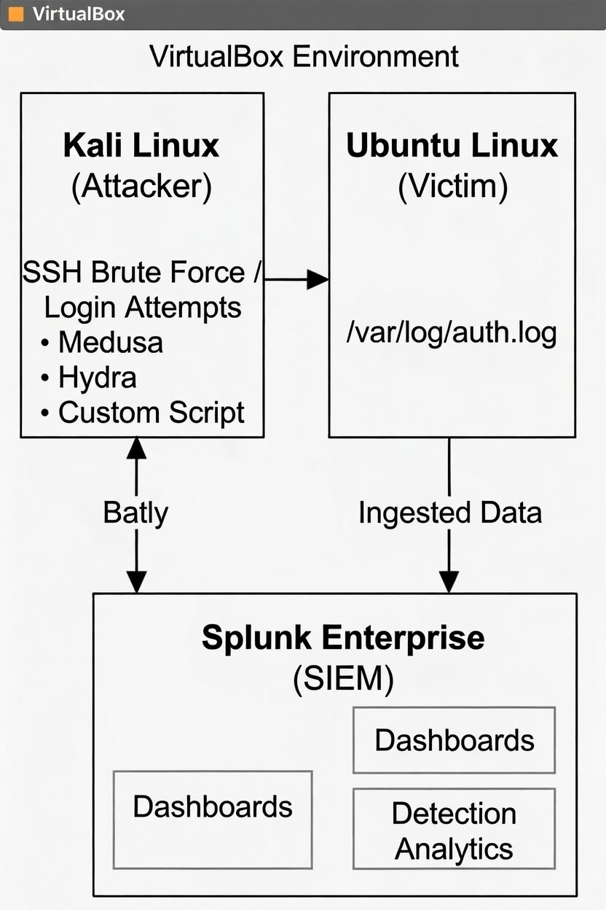
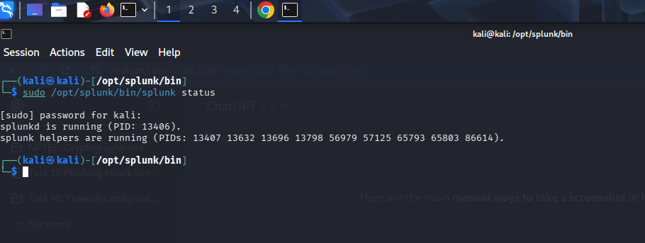
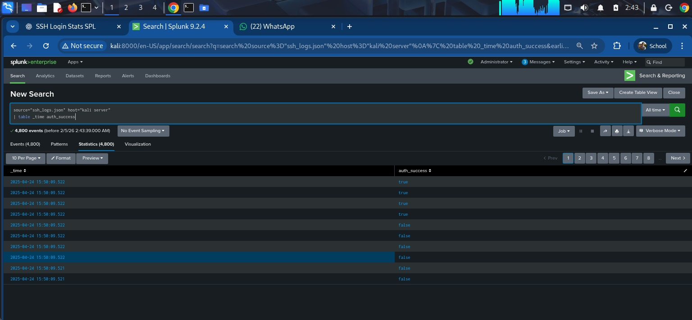
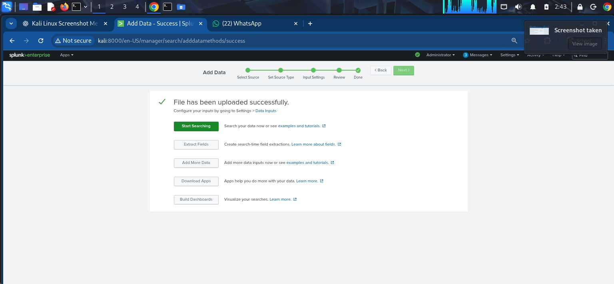
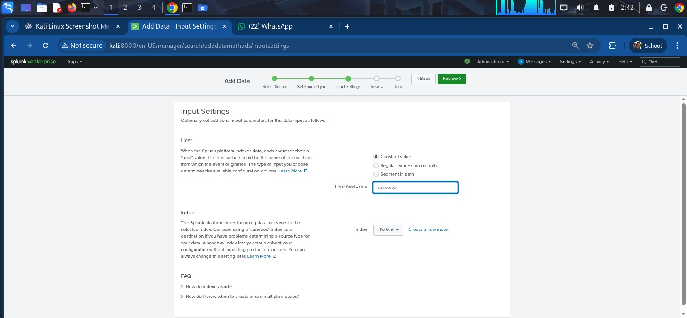
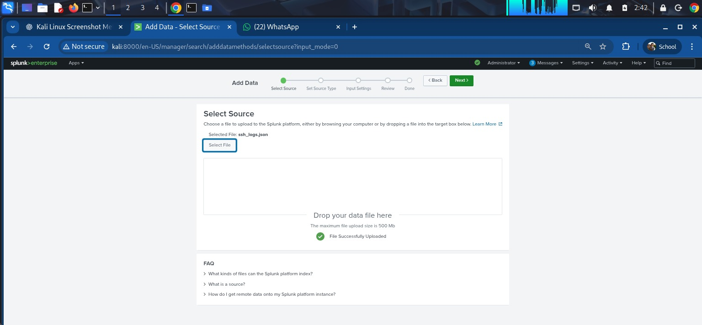
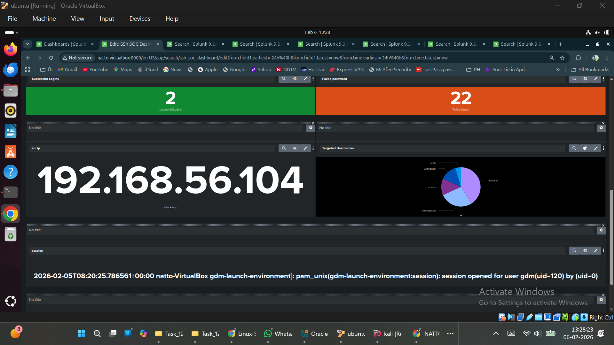

# 🔍 Splunk Log Analysis & Incident Detection Project


[](https://www.splunk.com)
[](https://www.kali.org)
[](#-project-overview)
[](Log_Analysis_Report.md)

---

## 📌 Project Overview

This repository demonstrates end-to-end log monitoring, SIEM analysis, threat hunting, and incident detection using **Splunk Enterprise** on a **Kali Linux** virtual environment. It simulates a real-world SOC (Security Operations Center) workflow where security log telemetry (`ssh_logs (1).json` containing 1,200 events) is ingested, parsed, analyzed, correlated, and visualized to identify brute-force attacks, port scanning, and suspicious network activity.

> 📄 **Complete Deliverable:** View the full executive-ready report in [Log_Analysis_Report.md](Log_Analysis_Report.md).

---

## 🎯 Key Objectives

- ⚙️ **SIEM Deployment:** Install, configure, and manage Splunk Enterprise on Kali Linux.
- 📥 **Log Ingestion:** Load and parse structured JSON security logs (`ssh_logs (1).json`) and system authentication logs (`auth.log`).
- 🔎 **SPL Threat Hunting:** Author custom Search Processing Language (SPL) queries to analyze authentication behavior.
- 🚨 **Incident Detection:** Identify failed logins, high-frequency brute-force attempts, and unauthenticated network probes.
- 🔗 **Event Correlation:** Track attack progressions across timestamps (failed logins leading to successful access).
- 📊 **Security Dashboarding:** Construct interactive, multi-panel Splunk Security Dashboards.
- 🔔 **SIEM Alerting:** Design real-time alert trigger rules for SOC incident response.
- 📝 **Professional Reporting:** Document findings, threat intelligence, and security hardening recommendations.

---

## 🗺️ Project Roadmap

- [x] **Phase 1: Environment Provisioning**
  - [x] Deploy Kali Linux virtual machine
  - [x] Install and configure Splunk Enterprise `v9.2.4`
  - [x] Establish isolated lab network

- [x] **Phase 2: Data Ingestion & Parsing**
  - [x] Collect authentic SSH log dataset (`ssh_logs (1).json`)
  - [x] Configure Splunk data inputs and indexing (`index=main`)
  - [x] Validate JSON field extraction and sourcetype parsing

- [x] **Phase 3: Threat Hunting & Analytics**
  - [x] Author SPL queries for failed login tracking
  - [x] Identify top attacker IPs and targeted subnets
  - [x] Correlate brute-force attempts leading to successful compromise

- [x] **Phase 4: Visualizations & Alerting**
  - [x] Build comprehensive SOC Security Dashboard
  - [x] Implement real-time alerting for high-volume brute-force attacks
  - [x] Create multi-panel visualizations (pie charts, timecharts, bar charts)

- [ ] **Phase 5: Future Enhancements (Planned)**
  - [ ] Integrate automated SOAR response (e.g., auto-blocking IPs via `fail2ban`)
  - [ ] Expand log sources to include Windows Event Logs and network traffic
  - [ ] Implement machine learning for anomaly detection (Splunk UBA)

---

## 🛠 Lab Architecture & Components

```
┌────────────────────────────────────────────────────────┐
│             Target Infrastructure / Endpoints          │
│   Linux Hosts (auth.log) / SSH Jump Servers / Datasets │
└───────────────────────────┬────────────────────────────┘
                            │ (Log Telemetry / JSON Feed)
                            ▼
┌────────────────────────────────────────────────────────┐
│            Splunk Ingestion & Indexing Engine           │
│   • Index: main                                        │
│   • Sourcetype: _json / linux_secure                   │
└───────────────────────────┬────────────────────────────┘
                            │ (SPL Query Execution)
                            ▼
┌────────────────────────────────────────────────────────┐
│             Splunk Security Dashboard (Web UI)         │
│   • Real-Time Threat Alerts                            │
│   • Auth Summary Metrics                               │
│   • Top Attacker IP Geolocation / Charts               │
└────────────────────────##───────────────────────────┘
```



### Tools & Requirements:
- **SIEM Engine:** Splunk Enterprise `v9.2.4`
- **Workstation OS:** Kali Linux x86_64
- **Primary Log Source:** `ssh_logs (1).json` (1,200 SSH events)
- **Web UI Endpoint:** `http://localhost:8000`

---

## ⚙️ Splunk Installation & Setup on Kali Linux

### Step 1: Download Splunk Enterprise Package
```bash
wget -O splunk-9.2.4-c103a21bb11d-linux-2.6-amd64.deb "https://download.splunk.com/products/splunk/releases/9.2.4/linux/splunk-9.2.4-c103a21bb11d-linux-2.6-amd64.deb"
```

### Step 2: Install Debian Package
```bash
sudo dpkg -i splunk-9.2.4-c103a21bb11d-linux-2.6-amd64.deb
# Fix any missing dependencies if prompted:
sudo apt --fix-broken install -y
```

### Step 3: Start Splunk Engine
```bash
sudo /opt/splunk/bin/splunk start --accept-license
```
*(Specify admin username and password when prompted)*


### Step 4: Verify Service Status & Enable Boot Start
```bash
sudo /opt/splunk/bin/splunk status
sudo /opt/splunk/bin/splunk enable boot-start
```



### Step 5: Access Web Interface
Open your web browser and navigate to:
```
http://localhost:8000
```
Log in using your configured admin credentials.


---

## 📂 Data Ingestion Workflow

1. Navigate to **Settings → Add Data → Upload**.
2. Select `ssh_logs (1).json` (or `/var/log/auth.log`).
3. Set Source Type to `_json` (or `linux_secure`).
4. Set Target Index to `main`.
5. Review schema and submit for indexing.

---

## 🔎 SPL Query Library for Threat Hunting

### 1️⃣ Summarize Security Events by Categorization
```spl
index=main 
| stats count by event_type 
| sort - count
```

### 2️⃣ Top Brute-Force Attacker Source IPs
```spl
index=main auth_success=false OR event_type="Multiple Failed Authentication Attempts"
| stats count as failed_attempts by id.orig_h
| where failed_attempts > 5
| sort - failed_attempts
```

### 3️⃣ Target Server Exposure & Connection Volume
```spl
index=main 
| stats count by id.resp_h, id.resp_p 
| sort - count
```

### 4️⃣ Unauthenticated Port 22 Probes
```spl
index=main event_type="Connection Without Authentication"
| stats count by id.orig_h, id.resp_h
| sort - count
```

### 5️⃣ Correlate Failed Logins Followed by Success
```spl
index=main 
| transaction id.orig_h maxspan=15m 
| search auth_success=true AND (event_type="Failed SSH Login" OR event_type="Multiple Failed Authentication Attempts")
| table _time, id.orig_h, id.resp_h, duration, eventcount
```

---

## 📊 Splunk Security Dashboard Showcase

### Full SOC Security Dashboard


### Dashboard Panels Breakdown:

| Panel # | Visual Component | Screenshot Reference | Description |
| :--- | :--- | :--- | :--- |
| **01** | Total SSH Log Count |  | Displays single-value metric of total ingested log events (1,200). |
| **02** | Auth Status Breakdown |  | Pie chart illustrating Successful vs Failed vs Unauthenticated attempts. |
| **03** | Attacker IP Ranking |  | Bar chart isolating top offending source IPs (`10.0.0.25`, `10.0.0.18`). |
| **04** | Server Load Distribution |  | Column chart showing connection distribution across target servers. |
| **05** | Timechart Event Velocity |  | Line graph tracking attack activity over timestamps. |

### Secondary Dashboard Overview



---

## 🚨 SIEM Alerts & Trigger Logic

```spl
# Alert 1: High-Volume Brute Force Detection
index=main (event_type="Failed SSH Login" OR event_type="Multiple Failed Authentication Attempts")
| stats count by id.orig_h
| where count >= 5
```
- **Trigger:** >5 failures within 5 minutes.
- **Action:** Send Email Alert & Execute Dynamic Firewall Block.

---

## 📄 Key Findings & Deliverables

- **Dataset Ingested:** 1,200 structured SSH log events (`ssh_logs (1).json`).
- **Malicious/Failed Ratio:** **50.67%** of overall traffic (608 failed/brute-force events).
- **Top Threat Actor IP:** `10.0.0.25` (39 total events, 31 failed/brute-force).
- **Primary Targeted Assets:** `10.0.1.6`, `10.0.1.2`, and `10.0.1.9`.
- **Detailed Security Report:** Complete SOC analysis, hardening guide, and interview Q&A available in [Log_Analysis_Report.md](Log_Analysis_Report.md).

---

## 🏁 Technical Interview Reference Q&A

1. **What is a Log?** Automatically recorded timestamped entries of system/network events.
2. **What is a SIEM?** Centralized software platform (Splunk, Sentinel) for log aggregation, search, correlation, and alerting.
3. **Why are Logs Important?** Essential for threat detection, incident forensics, auditing, and compliance.
4. **What is Anomaly Detection?** Identifying baseline deviations (e.g. unusual login volume or off-hour access).
5. **Examples of Security Logs:** `auth.log`, Windows Event Logs (4624/4625), Firewall logs, Sysmon, DNS logs.

*(See [Log_Analysis_Report.md](Log_Analysis_Report.md#9-technical-interview-questions--answers) for expanded technical answers)*
