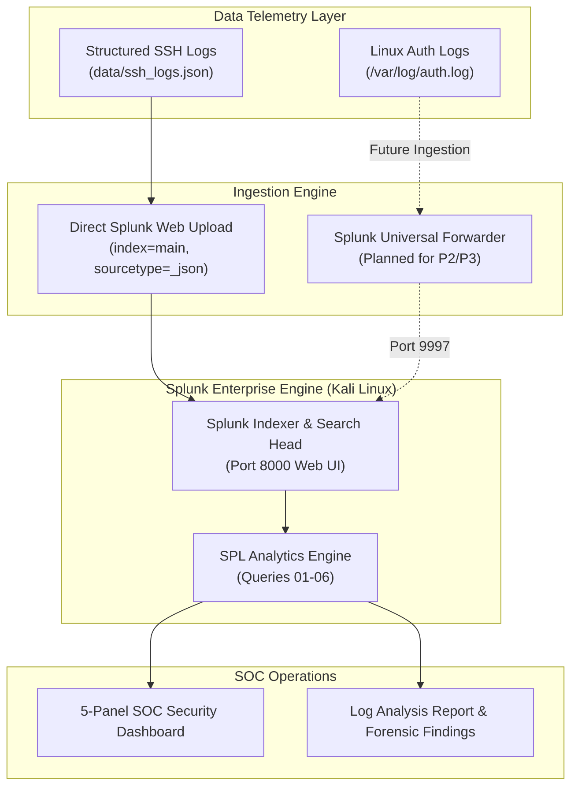

# 🏗️ SOC Lab Architecture & Data Flow

This document details the environment architecture and data flow for **P1 — Splunk SOC Home Lab & Log Analysis**, serving as the foundation for the [Splunk SOC & Threat Hunting Portfolio](https://github.com/NATTOMR/splunk-soc-threat-hunting-lab).

---

## Architecture Implementation Status

- **Splunk Enterprise SIEM:** ✅ **IMPLEMENTED** (Single-instance deployment on Kali Linux).
- **Direct JSON Log Ingestion:** ✅ **IMPLEMENTED** (1,200 structured SSH telemetry events).
- **Interactive Security Dashboards:** ✅ **IMPLEMENTED** (5-panel operational dashboard).
- **Universal Forwarder Layer:** ⚪ **PLANNED** (Decoupled forwarder pipeline scheduled for P2/P3).
- **Adversary Attack Simulation:** ⚪ **PLANNED** (Active Kali Linux adversary tooling in P4).

---

## Conceptual Architecture

---

## Component Specifications

| Component | Role | Version / Config | Status |
|---|---|---|:---:|
| **Splunk Enterprise** | Central SIEM engine & web console | `9.2.4` (Linux x86_64) | **IMPLEMENTED** |
| **Host Workstation** | Operating system host | Kali Linux (Kernel 6.x) | **IMPLEMENTED** |
| **Ingestion Target** | Storage index | `index=main` | **IMPLEMENTED** |
| **Sourcetype Parsing** | Field extraction schema | `_json` / `linux_secure` | **IMPLEMENTED** |
| **Universal Forwarder** | Endpoint log shipping agent | Splunk UF 9.x | **PLANNED** |
| **VirtualBox Network** | Isolated virtualization network | Host-Only / NAT Network | **IMPLEMENTED** |
