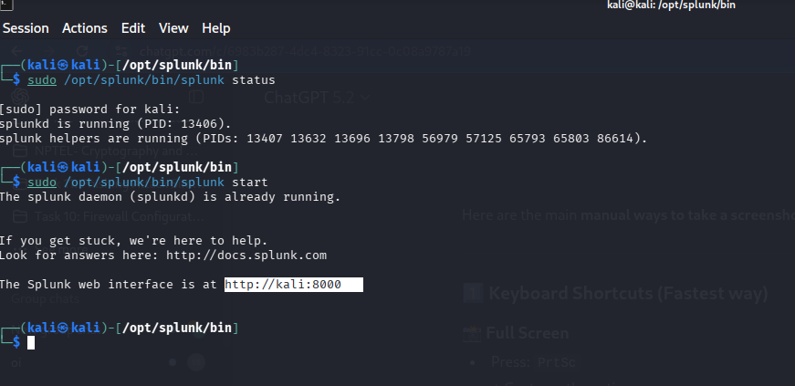
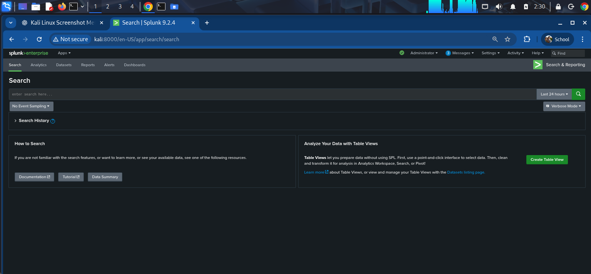

# ⚙️ Splunk Enterprise Installation & Setup Guide

This guide documents the verified installation and setup process for **Splunk Enterprise 9.2.4** on a **Kali Linux** virtual environment for Project P1.

---

## Implementation Status

- **Splunk Enterprise Deployment:** ✅ **IMPLEMENTED**
- **System Service Configuration:** ✅ **IMPLEMENTED**
- **Web UI Access:** ✅ **IMPLEMENTED**

---

## Prerequisites

- **Host Operating System:** Kali Linux x86_64 (or Debian/Ubuntu equivalent)
- **Privileges:** `sudo` / administrative rights
- **Disk Space:** Minimum 10 GB free space
- **RAM:** Minimum 4 GB (8 GB recommended)
- **Port Requirements:**
  - `8000/tcp`: Splunk Web GUI
  - `8089/tcp`: Splunk Management Port
  - `9997/tcp`: Splunk Indexing / Forwarder Receiver (Planned)

---

## Step-by-Step Installation

### Step 1: Download Splunk Debian Package
```bash
wget -O splunk-9.2.4-c103a21bb11d-linux-2.6-amd64.deb "https://download.splunk.com/products/splunk/releases/9.2.4/linux/splunk-9.2.4-c103a21bb11d-linux-2.6-amd64.deb"
```

### Step 2: Install Package
```bash
sudo dpkg -i splunk-9.2.4-c103a21bb11d-linux-2.6-amd64.deb

# If dependency warnings occur, resolve with apt:
sudo apt --fix-broken install -y
```

### Step 3: Accept License and Initialize Credentials
Start Splunk for the first time and configure the local administrative username and password:
```bash
sudo /opt/splunk/bin/splunk start --accept-license
```



### Step 4: Enable Service Boot-Start and Verify Status
Ensure Splunk starts automatically on system boot and verify running status:
```bash
sudo /opt/splunk/bin/splunk enable boot-start
sudo /opt/splunk/bin/splunk status
```


### Step 5: Access Splunk Web Console
Open a browser and navigate to:
```
http://localhost:8000
```
Log in using your administrator credentials created in Step 3.


